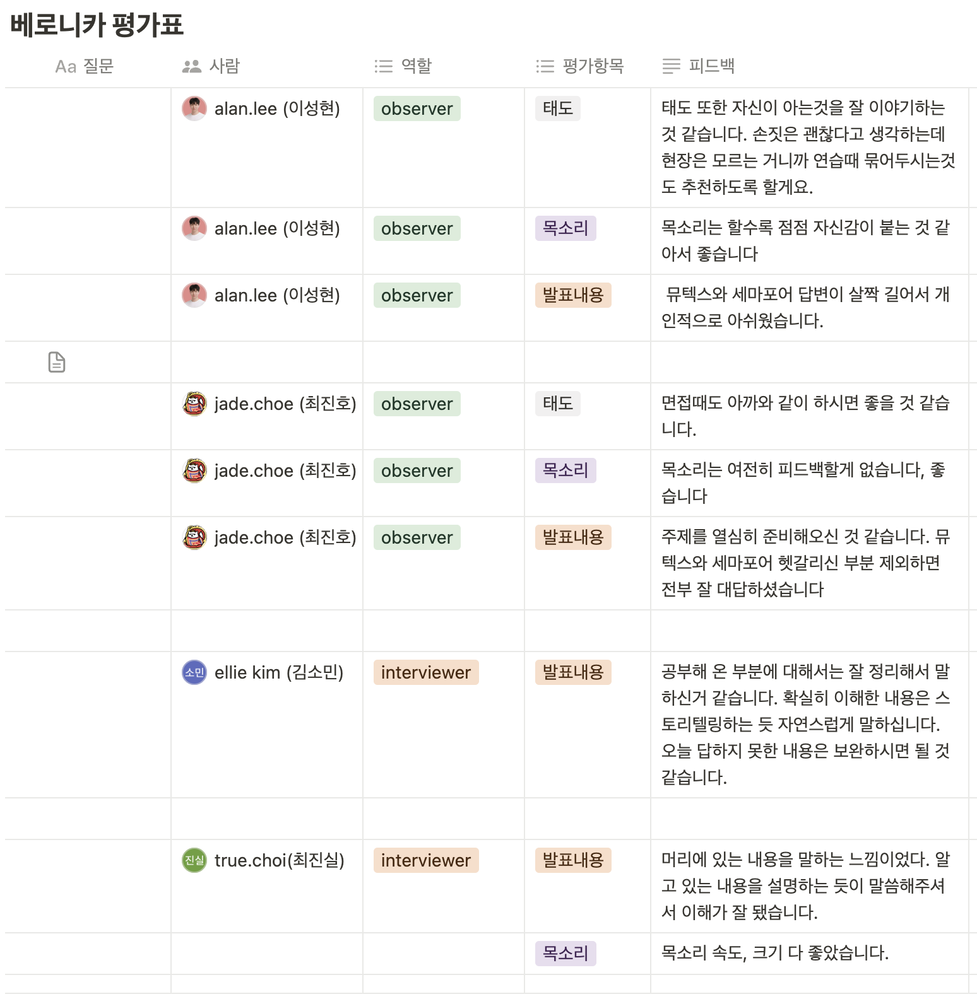
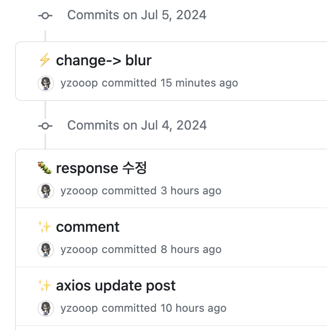

# TIL Template

# 날짜: 2024-07-04

# 스크럼
- ✅ 오늘 할일 : 1. 스터디 / 2. 코테 한문제 풀기 / 3. 댓글 컴포넌트 만들기
- 🙀 예상 이슈 : 없다
- 🍀 작일 회고 : 짜증났다.

# today issue
- 없음

## 알고리즘
런타임 에러로 collection library를 처음 적용하게 되었다.
바뀐건 별로 없고 pop -> popleft정도?
그래도 바뀐건 바뀐거니까 적응을 해봐야겠다. 
<table>
  <tr>
    <td>전
      <pre><code>import sys

def bfs(sy, sx):
    q = []
    q.append((sy, sx))
    v[sy][sx] = 1
    cnt = 1

    while q:
        cy, cx = q.pop(0)

        for dy, dx in ((1, 0), (-1, 0), (0, 1), (0, -1)):
            ny, nx = cy + dy, cx + dx

            if 0 <= ny < n and 0 <= nx < m and v[ny][nx] == 0 and arr[ny][nx] == 1:
                q.append((ny, nx))
                v[ny][nx] = 1
                cnt += 1
    return cnt

n, m = map(int, sys.stdin.readline().strip().split())

arr = [list(map(int, sys.stdin.readline().strip().split())) for _ in range(n)]
v = [[0] * m for _ in range(n)]
ans = []

for y in range(n):
    for x in range(m):
        if arr[y][x] == 1 and v[y][x] == 0:
            ans.append(bfs(y,x))

ans.sort()
print(len(ans), ans[-1])
      </code></pre>
    </td>
    <td>후<pre><code>
    import sys
    from collections import deque

def bfs(sy, sx):
    q = deque([(sy, sx)])
    v[sy][sx] = 1
    cnt = 1

    while q:
        cy, cx = q.popleft()

        for dy, dx in ((1, 0), (-1, 0), (0, 1), (0, -1)):
            ny, nx = cy + dy, cx + dx

            if 0 <= ny < n and 0 <= nx < m and not v[ny][nx] and arr[ny][nx]:
                q.append((ny, nx))
                v[ny][nx] = 1
                cnt += 1
    return cnt

input = sys.stdin.readline
n, m = map(int, input().split())

arr = [list(map(int, input().split())) for _ in range(n)]
v = [[0] * m for _ in range(n)]
max_size = 0
count = 0

for y in range(n):
    for x in range(m):
        if arr[y][x] and not v[y][x]:
            count += 1
            max_size = max(max_size, bfs(y, x))

print(count, max_size if count > 0 else 0)
    </code></pre>
    </td>
  </tr>
</table>

## 스터디

## 커뮤니티 프로젝트

# 🎱오늘의 회고
- 운영체제가 단골질문이라 완전 빠싹하게 알아야 될 것 같다. 자신 없는 주제라 준비시간이 길었는데 더 반복학습하면서 해야될 것 같다. 오늘이 면접중에 제일 아쉽다.
- 앞으로 2주간의 일정을 짜보았다. 열심히 살아가는 모습이 보기 좋다. 더 열심히 하고싶다 ㅎㅎ
- 정말 많은게 남았으면 좋겠다 ㅜㅜ