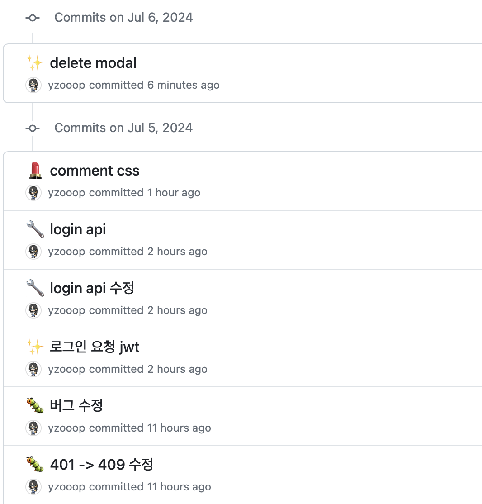

# TIL Template

# 날짜: 2024-07-05

# 스크럼
- ✅ 오늘 할일 : 1. 딥다이브 / 2. 댓글 컴포넌트 만들기 / 3. 모달 완성하기
- 🙀 예상 이슈 : 딥다이브
- 🍀 작일 회고 : 열심히 했다.

# today issue
- 딥다이브

# 딥다이브
## 파이프라인 (Pipeline) 이란?

파이프라인(Pipeline)은 일련의 작업 또는 프로세스를 체계적으로 연결하여 자동화한 시스템. 

사용 분야 : 소프트웨어 개발, 데이터 처리, 머신러닝 모델 학습 및 배포 등 

목적 : 작업의 효율성을 높이고, 일관성을 유지하며, 오류를 줄인다.

### 구성 요소 (일반적인 파이프라인)

1. **입력(Input)**: 데이터를 수집하거나 가져오는 단계
2. **처리(Processing)**: 데이터를 변환하거나 처리하는 단계
3. **출력(Output)**: 처리된 데이터를 저장하거나 다음 단계로 넘기는 단계
4. **검증(Validation)**: 데이터의 무결성 및 품질을 확인하는 단계
5. **모니터링(Monitoring)**: 파이프라인의 성능 및 오류를 모니터링하는 단계

## 배포 관점에서의 파이프라인

배포 관점에서의 파이프라인은 소프트웨어의 빌드(Build), 테스트(Test), 배포(Deploy)를 `자동화`하여 지속적 통합(Continuous Integration, CI)과 지속적 배포(Continuous Deployment, CD)를 구현하는 시스템

→ 단 한 번의 클릭이나 명령어 입력으로 전체 배포 과정을 자동으로 진행

→ 수동적이고 반복적인 배포 과정을 자동화함으로써 시간을 절약하고 휴먼 에러(Human Error)를 방지

### 주요 단계

1. **코드 빌드(Code Build)**: 소스 코드를 컴파일하고, 의존성을 해결하며, 빌드 아티팩트(artifact) 생성
2. **유닛 테스트(Unit Test)**: 개별 모듈이나 기능을 테스트하여 코드의 정확성을 검증
3. **통합 테스트(Integration Test)**: 여러 모듈이 통합된 환경에서 시스템의 동작을 검증
4. **배포 준비(Staging)**: 실제 배포 전, 배포 환경과 유사한 환경에서 최종 검증을 수행
5. **프로덕션 배포(Production Deployment)**: 최종 사용자에게 소프트웨어를 배포
6. **모니터링 및 롤백(Monitoring & Rollback)**: 배포된 소프트웨어의 성능을 모니터링하고, 문제가 발생할 경우 롤백

파이프라인의 단계는 필요에 따라 더 세분화되거나 간소화될 수 있다. 

또한, 해당 툴을 소개하는 업체에 따라 용어를 미묘하게 다르게 사용하기도 한다.

### 도구 및 기술

- **CI/CD 도구**: Jenkins, GitLab CI, Travis CI, CircleCI 등
- **컨테이너화 도구**: Docker, Kubernetes
- **클라우드 서비스**: AWS, Azure, GCP

### CI/CD 파이프라인 구성 요소

- **빌드(Build)**: 소프트웨어를 컴파일하여 실행 가능한 상태로 만든다.
- **테스트(Test)**: 호환성 및 오류를 검사한다.
- **릴리스(Release)**: 버전 제어 저장소의 애플리케이션을 업데이트한다.
- **배포(Deploy)**: 개발 환경에서 프로덕션 환경으로 변환한다.
- **규정 준수 및 유효성 검사(Compliance and Validation)**: 규정 준수 여부를 확인하고 유효성을 검사한다.

### 장점

- **효율성**: 수동으로 배포하는 것보다 더 빠르고 안정적
- **일관성**: 매번 동일한 절차를 따르므로 휴먼 에러 감소
- **생산성 향상**: 개발자가 반복적인 작업에서 해방되어 더 중요한 작업에 집중 가능
- **신뢰성**: 자동화된 테스트와 배포를 통해 신뢰할 수 있는 소프트웨어를 제공

## 로그 파이프라인 (Log Pipeline)

: 생성된 로그 데이터를 수집, 처리, 저장 및 분석하는 일련의 작업을 `자동화`한 시스템입니다. 로그 파이프라인의 목표는 실시간 모니터링, 문제 해결, 보안 분석 및 규정 준수를 지원하는 것입니다.

### 주요 단계

1. **로그 수집(Log Collection)**
2. **로그 처리(Log Processing)**: 로그 데이터를 정규화, 필터링, 집계하여 유용한 정보로 변환
3. **로그 저장(Log Storage)**: 일반적으로 검색 및 분석이 용이한 형태로 저장
4. **로그 분석(Log Analysis)**: 저장된 로그 데이터를 분석하여 인사이트를 도출
5. **모니터링 및 알림(Monitoring & Alerting)**: 특정 이벤트나 이상 징후를 실시간으로 감지하고 알림을 설정

### 도구 및 기술

- **로그 수집 도구**: Fluentd, Logstash, Beats
- **로그 저장소**: Elasticsearch, Splunk, Grafana Loki
- **로그 분석 도구**: Kibana, Grafana, Splunk

## 커뮤니티 프로젝트

- 이메일, 닉네임 중복 api 수정하고 onFocus 만짐
- 인텔리제이 build파일 수정하고, gitignore수정한거 pull 받아서 백엔드 서버 띄워봄

# 🎱오늘의 회고
- 회원가입 axios완료했다. jwt더 공부해서 인증하는거 해봐야지
- 주말에 머리박고 합시다!