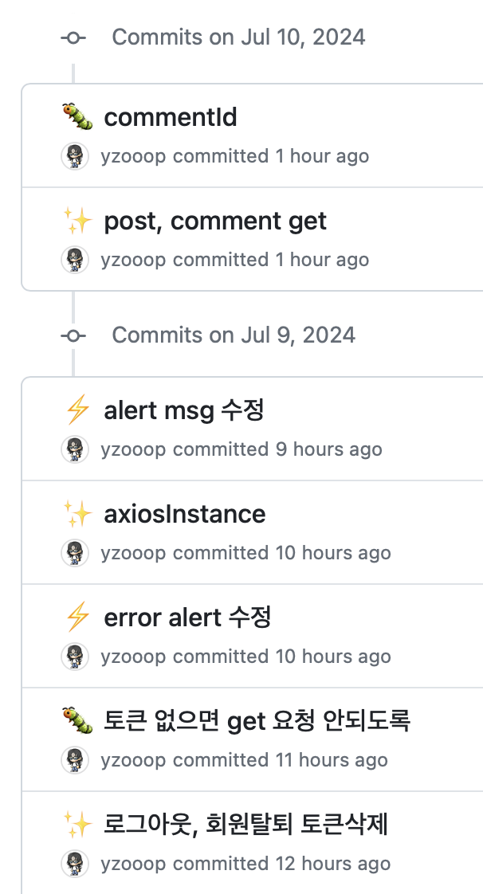

# TIL Template

# 날짜: 2024-07-08

# 스크럼
- ✅ 오늘 할일 : 1. 수정완료하기 / 2. 포스트 시작
- 🙀 예상 이슈 : 외출
- 🍀 작일 회고 : 유저 오나료 ~~~

# today issue
- 외출

## 커뮤니티 프로젝트

유저 끝 ~~~~!!! 
물론 자잘하게 수정할거 3개정도 있긴 한데  
priority 높은건 다 했다. ㅎㅎ

- [jwt refresh token](https://inpa.tistory.com/entry/WEB-%F0%9F%93%9A-Access-Token-Refresh-Token-%EC%9B%90%EB%A6%AC-feat-JWT) 위 링크에서 공부 좀 했는데 헷갈리는 개념이 많아서, 공부 다시 하고 제프한테 물어봐야겠음

# 🎱오늘의 회고
- 포스트랑 유저랑 뭐가 좀 꼬여서 db 다시 설계하는 중 ...
- 이 기세면 목요일 까지 끝낼 수 있을듯??