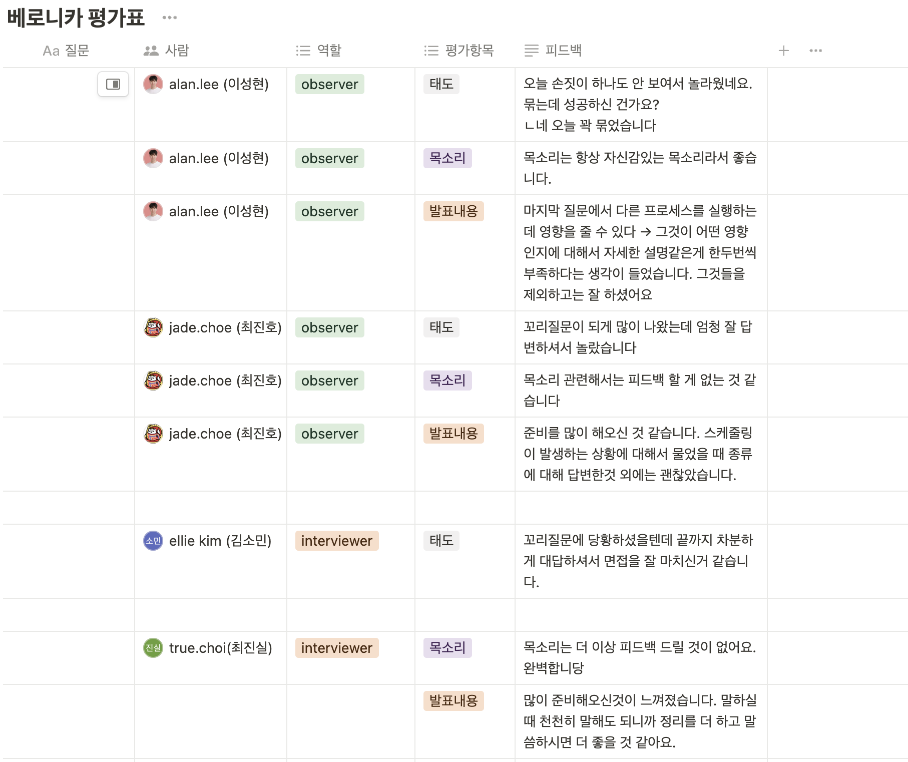
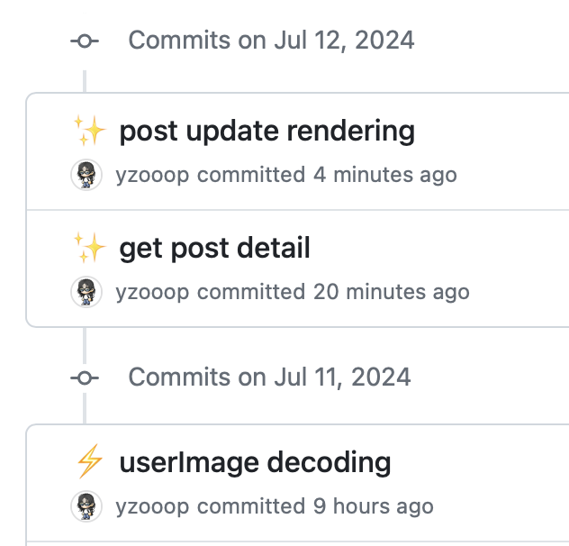

# TIL Template

# 날짜: 2024-07-11

# 스크럼
- ✅ 오늘 할일 : 포스트 조회, 수정 하기 / 스터디 / 해커톤회의
- 🙀 예상 이슈 : 없음
- 🍀 작일 회고 : 무기력했다.

# today issue
- 없음

## 면접 스터디

os는 처음이라 정말 잘 모르겠다 … 꼬리질문 하나도 대답 못했고 대답을 하면서도 자신이 없었다. 그래도 이번주 질문은 잘 외웠지만 앞으로 틈틈히 os를 꾸준하게 공부해야 겠다고 다짐했다. 

## 커뮤니티 프로젝트

- 이슈 : useEffect로 data를 받아오는데, 이 state의 초기값이 null이어서 렌더링 할 때 계속 undefined 되는 문제가 있었다.
- 해결 : 
```
<div className='post-title'>{post?.title}</div>
```
이런식으로 null값일 때 처리하는 `옵셔널 체이닝 연산자`를 이용한다.
- 옵셔널 체이닝 연산자란? : 객체의 속성에 접근할 때 해당 속성이 존재하지 않는 경우 오류를 발생시키지 않고 undefined를 반환하도록 한다. 즉, post 객체가 null이거나 undefined인 경우, post.title에 접근하려고 하면 오류가 발생하지만, 옵셔널 체이닝을 사용하면 안전하게 undefined를 반환한다.

## 해커톤 회의
- 각자 가져온 주제를 발표했다.
- 주제를 정했다. 
- 해커톤을 통해 집중하는 능력과 어떤점을 선택하고 버릴지를 많이 배워야 겠다.
- 특히 프론트 분야에서 더 능력있게 성장하고 싶다.


# 🎱오늘의 회고
- 오류를 수정해가는게 너무 재밌다. gpt없이 오롯이 머리로만 코드를 작성할 수 있었으면 좋겠다. 내코드를 복습하는 시간을 무조건 가질것이다.