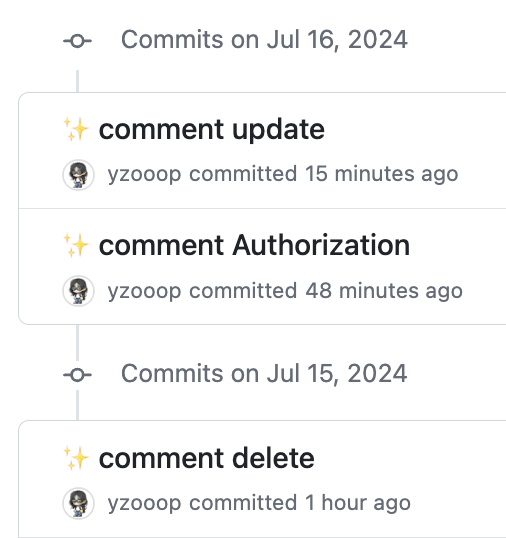
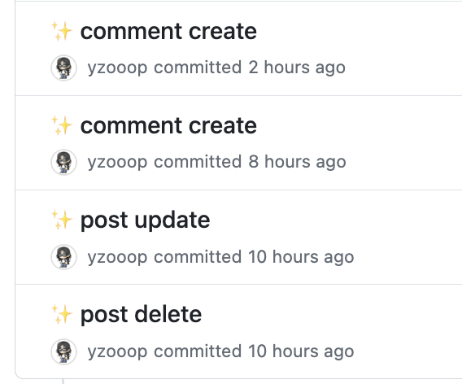

# TIL Template

# 날짜: 2024-07-15

# 스크럼
- ✅ 오늘 할일 : 커뮤니티 끝내기, 해커톤 회고하기, 코테스터디
- 🙀 예상 이슈 : 없음
- 🍀 작일 회고 : 밤새서 그런가 머리가 너무 아푸다 ...!

# today issue
- 없음

## 알고리즘 스터디
- 이게 맞나 싶지만 이게 맞는거다 ... ! 일단 딴건 됐고 dfs, bfs랑 dp부터 조지자 ...!!!

## 커뮤니티 프로젝트
with E 
✅ 게시글 수정 
✅ 게시글 삭제 
✅ 댓글 등록 -> 500에러 -> 내가 null값을 주고 있었다 ㅎ 수정 !! 
✅ 댓글 수정 -> CORS에러 -> 엘리는 put으로 하고 나는 patch로 했다 
✅ 댓글 삭제 
📋 남은건 이미지뿐 
+♻ 코드 리팩토링 틈틈이 하자 !!

|  |  |
|---------------------------|---------------------------|

todo : 로그인 안한 채로 url 접근 못하게 하기

## 해커톤 회고
- [노션링크](https://www.notion.so/9bd5c57250064effb2dedeae40c7a5ab?pvs=4)

# 🎱오늘의 회고
- 커뮤니티 끝내서 너무 좋다..... 근데 아직 완벽하게 끝낸게 아니라 t 덜한거 + e 이미지 받아서 완.전 다 끝내고 싶다. 리드미는 차근차근히 적어보고, 포폴에 어떤것을 넣을지 구상해봐야겠다.
- 해커톤 회고를 해보았는데, 앞으로 어떤 프로젝트를 하든 트러블슈팅은 꼼꼼하게 적어놓아야겠다. TIL쓰는 습관을 들이게 돼서 좋다 !!