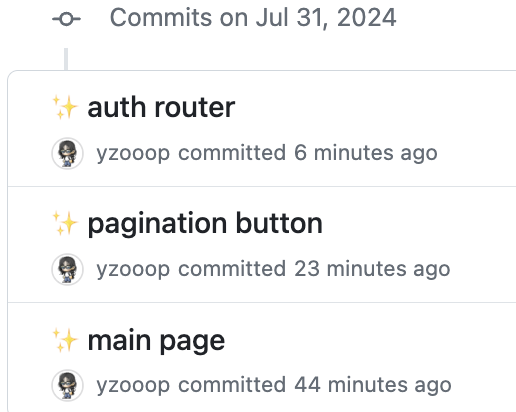

# TIL Template

# 날짜: 2024-07-30

# 스크럼
- ✅ 오늘 할일 : 화면설계서 / 르방
- 🙀 예상 이슈 : 없음
- 🍀 작일 회고 : 르방 빡세게 했다

## 르방
- 이미지 해결 -> "/" 이거 중요성 깨닫게 되었다 ... 
- auth router
- pagination : hasNext, hasPrevious 유무에 따라 버튼 조정 완
- todo : 아이콘 등록하기 / 편지 열리는건 에리얼이

## 파이널팀
- 화면설계서 보이드한테 피드백 못받았다
- 피그마에 기능설계서랑 api명세서 넣었다 
- 피그마에 표 넣는건 어렵다...

# 🎱오늘의 회고
- 하이든과의 대화 재밌었다 희희
- 내일 시간 되는대로 르방 빨리 완성하자 ... ㅠㅡㅠ