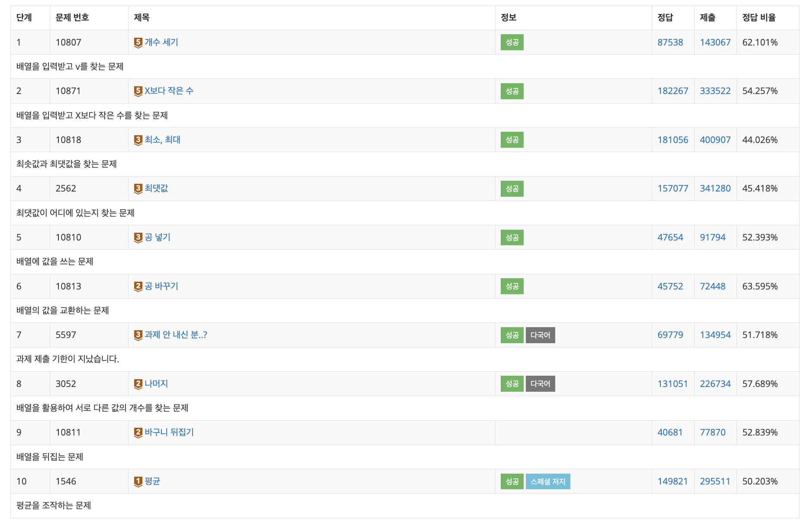
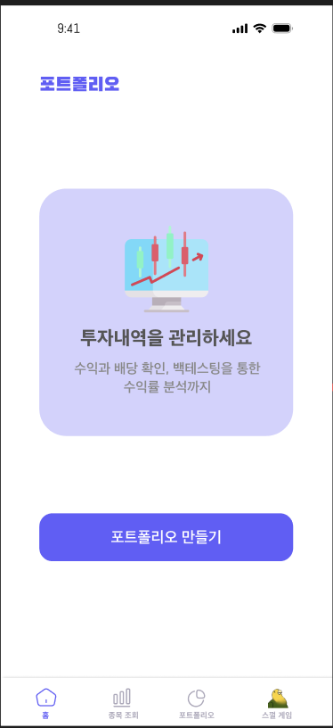
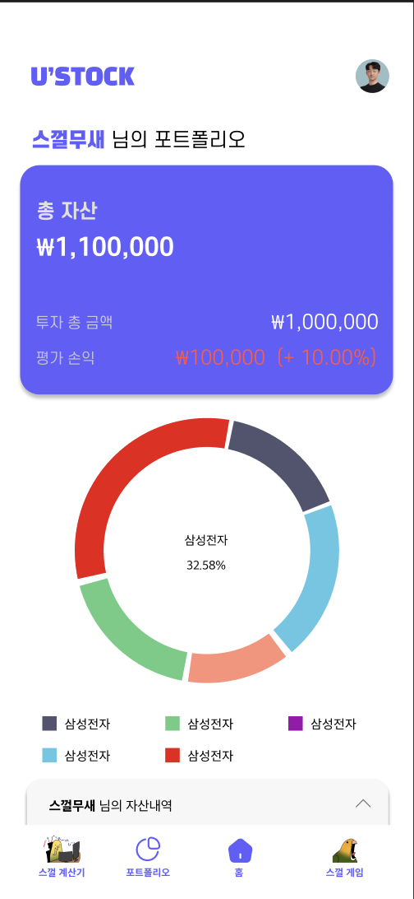
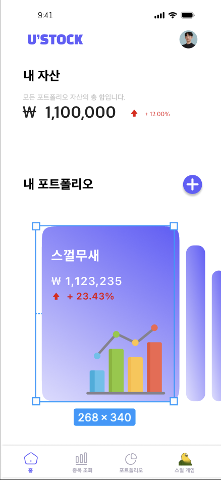
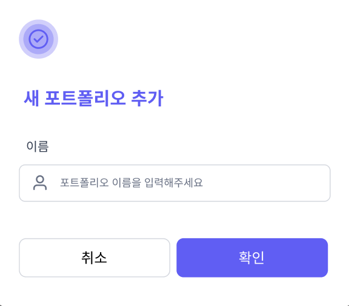
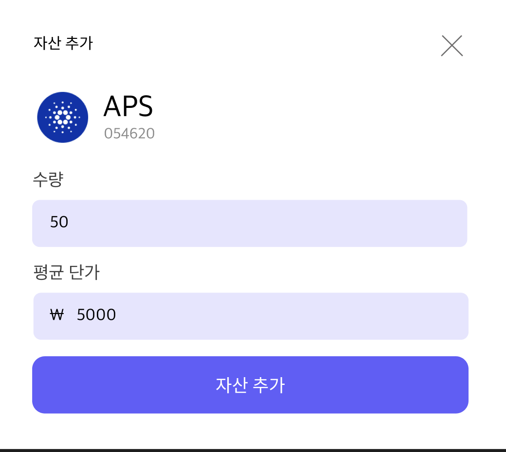
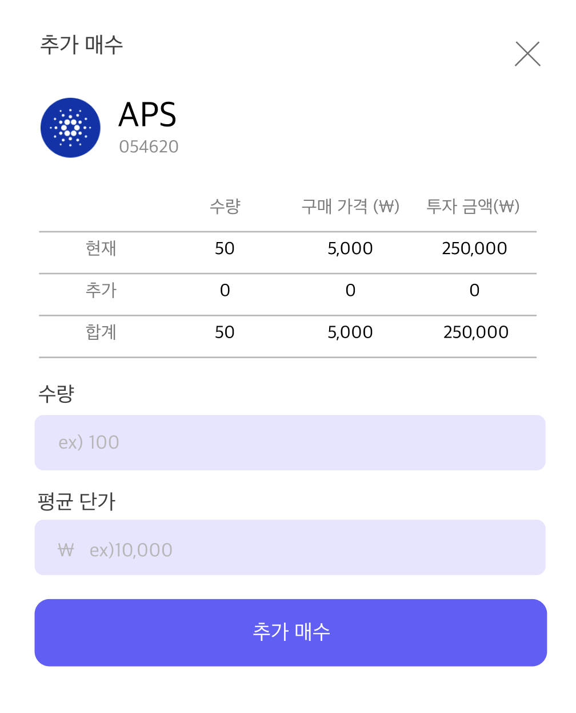
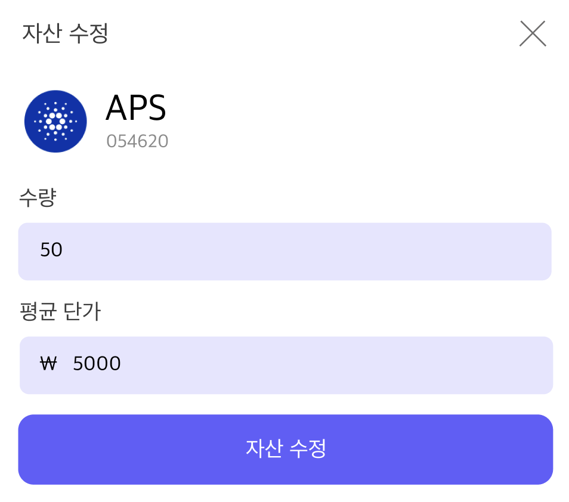

# TIL Template

# 날짜: 2024-08-13

# 스크럼
- ✅ 오늘 할일 : 코테 문제 올리기 / 디자인 마무리 !!!!!!
- 🙀 예상 이슈 : 잠온다
- 🍀 작일 회고 : 어제 디자인을 많이 못했다

## 코테
- 파이썬 중복제거 : set
- a = [1,1,2,3]
- b = list(set(a))
-> b : [1,2,3]
---

## Ustock
| Column 1 | Column 2 | Column 3 | Column 4 |
|----------|----------|----------|----------|
| | |||
|||||

# 🎱오늘의 회고
- 배열 제대로 안해놓으니까 진짜 어렵다.. 내일은 조건문 반복문 갑니다
- 디자인은 정말로 어렵다,, 레퍼런스 많이 찾아서 열심히 했다
- 내일부터 레이아웃 들어가는데 진짜 열심히 붍워야겠다 🔥