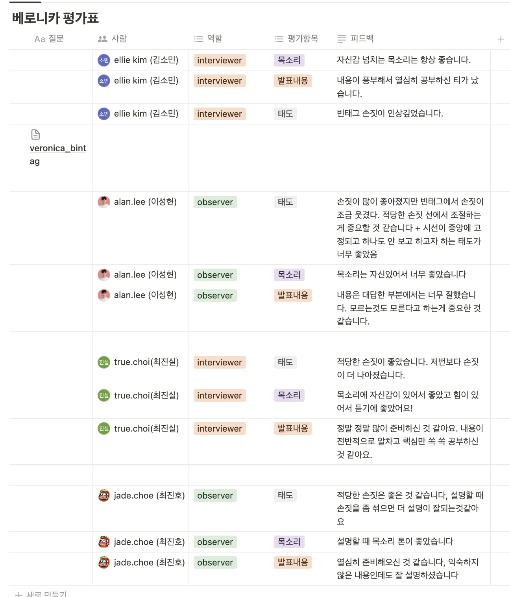

# TIL Template

# 날짜: 2024-06-27

# 스크럼
- ✅ 오늘 할일 : 스터디, 훅 분리하기
- 🙀 예상 이슈 : 없음
- 🍀 작일 회고 : 스터디 준비를 했다.

# today issue
- 없음

## 스터디


**스터디 회고**
- 손을 안쓰려고 노력을 많이 했는데 이정도면 적당하다는 피드백을 받아서 좋았던 것 같다. 스프링 진짜 몰라서 이해하기보다는 외운 느낌이 개인적으로 강해서 많이 아쉬운 것 같다. 대답도 몇개 못했지만 그래도 딜리버리 측면에선 괜찮았던 것 같다.

## 코드 리팩토링
- 훅 분리 -> 반복되는 코드가 많아서 useHook으로 분리해주었다.

## 🟠 전
```javascript
import "../style/pages/Join.css"
import Header from "../components/Header"
import InfoInput from "../components/InfoInput"
import { PurpleLongBtn, NoStyleButton } from "../components/Button"
import { useNavigate } from "react-router-dom"
import { validateEmail, validatePassword, validateConfirmPassword ,validateNickname, setHelperMsgAndStyle } from "../util/validator"
import { useState } from "react"

function Join() {
    const nav = useNavigate()
    const [imageUrl, setImageUrl] = useState(null);

    const [email, setEmail] = useState("")
    const [emailHelperMsg, setEmailHelperMsg] = useState("");
    const [emailHelperStyle, setEmailHelperStyle] = useState("error");
    const [isEmailValid, setIsEmailValid] = useState(false);

    const [password, setPassword] = useState("")
    const [passwordHelperMsg, setPasswordHelperMsg] = useState("");
    const [passwordHelperStyle, setPasswordHelperStyle] = useState("error");
    const [isPasswordValid, setIsPasswordValid] = useState(false);

    const [confirmPassword, setConfirmPassword] = useState("")
    const [confirmPasswordHelperMsg, setConfirmPasswordHelperMsg] = useState("");
    const [confirmPasswordHelperStyle, setConfirmPasswordHelperStyle] = useState("error");
    const [isConfirmPasswordValid, setIsConfirmPasswordValid] = useState(false);

    const [nickname, setNickname] = useState("")
    const [nicknameHelperMsg, setNicknameHelperMsg] = useState("");
    const [nicknameHelperStyle, setNicknameHelperStyle] = useState("error");
    const [isNicknameValid, setIsNicknameValid] = useState(false);
    
    const handleFormSubmit = (e) => {
        e.preventDefault();
        
        if (isEmailValid && isPasswordValid && isConfirmPasswordValid && isNicknameValid) {
            console.log("회원가입 완료");
            // 회원가입 로직
            
        } else {
            console.log("유효하지 않은 입력값이 있습니다.");
        }
    }

    const handleImageChange = (e) => {
        const file = e.target.files[0]
        if (file) {
            const reader = new FileReader()
            reader.onloadend = () => {
                setImageUrl(reader.result)
            }
            reader.readAsDataURL(file)
        }
    }

    const handleEmailChange = (e) => {
        const emailValue = e.target.value;
        setEmail(emailValue);
        const emailValidation = validateEmail(emailValue);
        setHelperMsgAndStyle(setEmailHelperMsg, setEmailHelperStyle, emailValidation);
        setIsEmailValid(emailValidation.isValid);
    };

    const handlePasswordChange = (e) => {
        const passwordValue = e.target.value;
        setPassword(passwordValue);
        const passwordValidation = validatePassword(passwordValue);
        setHelperMsgAndStyle(setPasswordHelperMsg, setPasswordHelperStyle, passwordValidation);
        setIsPasswordValid(passwordValidation.isValid);
    };

    const handleConfirmPasswordChange = (e) => {
        const confirmPasswordValue = e.target.value;
        setConfirmPassword(confirmPasswordValue);
        const confirmPasswordValidation = validateConfirmPassword(password, confirmPasswordValue);
        setHelperMsgAndStyle(setConfirmPasswordHelperMsg, setConfirmPasswordHelperStyle, confirmPasswordValidation);
        setIsConfirmPasswordValid(confirmPasswordValidation.isValid);
    };

    const handleNicknameChange = (e) => {
        const nicknameValue = e.target.value;
        setNickname(nicknameValue);
        const nicknameValidation = validateNickname(nicknameValue);
        setHelperMsgAndStyle(setNicknameHelperMsg, setNicknameHelperStyle, nicknameValidation);
        setIsNicknameValid(nicknameValidation.isValid);
    };

    return (
        <>
            <Header showBackButton={true} showCircleButton={false} nav={nav} />
            <form id="joinForm" onSubmit={handleFormSubmit}>
                <div className="title" style={{marginTop:"70px"}}>회원가입</div>
                <div className="InputBox">
                    <div className="InputBoxTitle">프로필 사진</div>
                    <div className="prf-img">
                        <input
                        className="image"
                        id="fileUpload"
                        type="file"
                        accept=".jpg,.png"
                        name="userPicture"
                        onChange={handleImageChange}
                        />
                        <label 
                            id="fileUpload-label" 
                            htmlFor="fileUpload"
                            className={imageUrl ? 'has-image' : ''}
                            style={imageUrl ? { backgroundImage: `url(${imageUrl})` } : {}}
                        ></label>
                    </div>
                </div>
                <InfoInput
                    title="이메일"
                    type="email"
                    placeholder="이메일을 입력하세요"
                    value={email}
                    onChange={handleEmailChange}
                    helperMsg={emailHelperMsg}
                    helperStyle={emailHelperStyle}
                />
                <InfoInput
                    title="비밀번호"
                    type="password"
                    placeholder="비밀번호를 입력하세요"
                    value={password}
                    onChange={handlePasswordChange}
                    helperMsg={passwordHelperMsg}
                    helperStyle={passwordHelperStyle}
                />
                <InfoInput
                    title="비밀번호 확인"
                    type="password"
                    placeholder="비밀번호를 한 번 더입력하세요"
                    value={confirmPassword}
                    onChange={handleConfirmPasswordChange}
                    helperMsg={confirmPasswordHelperMsg}
                    helperStyle={confirmPasswordHelperStyle}
                />
                <InfoInput
                    title="닉네임"
                    type="text"
                    placeholder="닉네임을 입력하세요"
                    value={nickname}
                    onChange={handleNicknameChange}
                    helperMsg={nicknameHelperMsg}
                    helperStyle={nicknameHelperStyle}
                />
                <PurpleLongBtn ButtonName="회원가입" />
            </form >
            <NoStyleButton ButtonName="로그인하러 가기" onClick={() => nav('/')} />
        </>
    )
}

export default Join
```

## 🟢 후
```javascript
import "../style/pages/Join.css";
import Header from "../components/Header";
import InfoInput from "../components/InfoInput";
import { PurpleLongBtn, NoStyleButton } from "../components/Button";
import { useNavigate } from "react-router-dom";
import { validateEmail, validatePassword, validateConfirmPassword, validateNickname } from "../util/validator";
import useValidation from "../hooks/useValidation";
import { useState } from "react";

function Join() {
    const nav = useNavigate();
    const [imageUrl, setImageUrl] = useState(null);

    const {
        value: email,
        helperMsg: emailHelperMsg,
        helperStyle: emailHelperStyle,
        isValid: isEmailValid,
        handleChange: handleEmailChange
    } = useValidation("", validateEmail);

    const {
        value: password,
        helperMsg: passwordHelperMsg,
        helperStyle: passwordHelperStyle,
        isValid: isPasswordValid,
        handleChange: handlePasswordChange
    } = useValidation("", validatePassword);

    const {
        value: confirmPassword,
        helperMsg: confirmPasswordHelperMsg,
        helperStyle: confirmPasswordHelperStyle,
        isValid: isConfirmPasswordValid,
        handleChange: handleConfirmPasswordChange
    } = useValidation("", value => validateConfirmPassword(password, value));

    const {
        value: nickname,
        helperMsg: nicknameHelperMsg,
        helperStyle: nicknameHelperStyle,
        isValid: isNicknameValid,
        handleChange: handleNicknameChange
    } = useValidation("", validateNickname);

    const handleFormSubmit = (e) => {
        e.preventDefault();

        if (isEmailValid && isPasswordValid && isConfirmPasswordValid && isNicknameValid) {
            console.log("회원가입 완료");
            // 회원가입 로직
        } else {
            console.log("유효하지 않은 입력값이 있습니다.");
        }
    };

    const handleImageChange = (e) => {
        const file = e.target.files[0];
        if (file) {
            const reader = new FileReader();
            reader.onloadend = () => {
                setImageUrl(reader.result);
            };
            reader.readAsDataURL(file);
        }
    };

    return (
        <>
            <Header showBackButton={true} showCircleButton={false} nav={nav} />
            <form id="joinForm" onSubmit={handleFormSubmit}>
                <div className="title">회원가입</div>
                <div className="InputBox">
                    <div className="InputBoxTitle">프로필 사진</div>
                    <div className="prf-img">
                        <input
                            className="image"
                            id="fileUpload"
                            type="file"
                            accept=".jpg,.png"
                            name="userPicture"
                            onChange={handleImageChange}
                        />
                        <label
                            id="fileUpload-label"
                            htmlFor="fileUpload"
                            className={imageUrl ? 'has-image' : ''}
                            style={imageUrl ? { backgroundImage: `url(${imageUrl})` } : {}}
                        ></label>
                    </div>
                </div>
                <InfoInput
                    title="이메일"
                    type="email"
                    placeholder="이메일을 입력하세요"
                    value={email}
                    onChange={handleEmailChange}
                    helperMsg={emailHelperMsg}
                    helperStyle={emailHelperStyle}
                />
                <InfoInput
                    title="비밀번호"
                    type="password"
                    placeholder="비밀번호를 입력하세요"
                    value={password}
                    onChange={handlePasswordChange}
                    helperMsg={passwordHelperMsg}
                    helperStyle={passwordHelperStyle}
                />
                <InfoInput
                    title="비밀번호 확인"
                    type="password"
                    placeholder="비밀번호를 한 번 더 입력하세요"
                    value={confirmPassword}
                    onChange={handleConfirmPasswordChange}
                    helperMsg={confirmPasswordHelperMsg}
                    helperStyle={confirmPasswordHelperStyle}
                />
                <InfoInput
                    title="닉네임"
                    type="text"
                    placeholder="닉네임을 입력하세요"
                    value={nickname}
                    onChange={handleNicknameChange}
                    helperMsg={nicknameHelperMsg}
                    helperStyle={nicknameHelperStyle}
                />
                <PurpleLongBtn ButtonName="회원가입" />
            </form>
            <NoStyleButton ButtonName="로그인하러 가기" onClick={() => nav('/')} />
        </>
    );
}

export default Join;

```
커스텀 훅 : useValidation
```javascript
import { useState } from 'react';
import { setHelperMsgAndStyle } from '../util/validator';

const useValidation = (initialValue, validateFunction) => {
    const [value, setValue] = useState(initialValue);
    const [helperMsg, setHelperMsg] = useState("");
    const [helperStyle, setHelperStyle] = useState("error");
    const [isValid, setIsValid] = useState(false);

    const handleChange = (e) => {
        const value = e.target.value;
        setValue(value);
        const validation = validateFunction(value);
        setHelperMsgAndStyle(setHelperMsg, setHelperStyle, validation);
        setIsValid(validation.isValid);
    };

    return { value, helperMsg, helperStyle, isValid, handleChange };
};

export default useValidation;
```


# 🎱오늘의 회고
- 스터디 하길 정말 잘했다. 팀원들과의 시너지도 더 나는듯?
- api만 들어오면 되게 세팅 열심히 해야겠다.